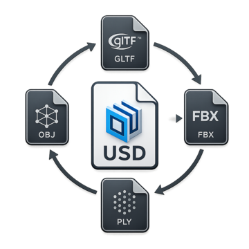

# Universal Scene Converter

`USC` is a small CLI tool for converting OpenUSD, FBX, OBJ, STL, and glTF files.

It's a standalone tool built on top of [Adobe's USD conversion plugins](https://github.com/adobe/USD-Fileformat-plugins).

<p align="center">
  
</p>

## Promo video

https://github.com/user-attachments/assets/ef95c886-8797-4bf7-aa7c-daea22022acd

## Quick start

Download `universal-scene-converter-windows-x64.zip` from the [latest release](https://github.com/Ahmed-Hindy/universal-scene-converter/releases/latest).

Extract the complete ZIP before running it.
Open PowerShell or Command Prompt in the extracted folder:

```powershell
.\bin\usdconvert.exe model.obj
.\bin\usdconvert.exe model.fbx model.usdc
.\bin\usdconvert.exe model.usda -o model.glb
.\bin\usdconvert.exe model.usda -o model.glb --force
```

## Batch conversion

Convert explicit files:

```powershell
.\bin\usdconvert.exe asset-a.fbx asset-b.obj `
    --output-dir converted --output-format usdc
```

Convert a directory while preserving its relative subdirectory layout:

```powershell
.\bin\usdconvert.exe assets --recursive `
    --output-dir converted --output-format glb
```

Batch options:

- `--output-dir <directory>` places generated files under one output root.
- `--output-format <extension>` selects one output format, with or without a leading dot.
- `--recursive` includes nested files and requires a directory input.
- `--force` replaces existing main files and generated sidecars transactionally.
- `--json` emits one machine-readable result object to standard output.
- `--quiet` suppresses successful progress and summary text while retaining errors.

## Automation

```powershell
$result = .\bin\usdconvert.exe model.fbx -o model.usdc --json |
    ConvertFrom-Json

if (-not $result.success) {
    throw $result.message
}
```

The full contract and compatibility rules are documented in [JSON_OUTPUT.md](JSON_OUTPUT.md). A JSON Schema is included in the release at `schemas\usdconvert-result.schema.json`.

Show help or version information:

```powershell
.\bin\usdconvert.exe --help
.\bin\usdconvert.exe --version
```

## Supported formats

All listed formats can be used as input or output:

| Format | Extensions |
|---|---|
| OpenUSD | `.usd`, `.usda`, `.usdc`, `.usdz` |
| Autodesk FBX | `.fbx` |
| Wavefront OBJ | `.obj` |
| STL | `.stl` |
| glTF | `.gltf`, `.glb` |

Universal Scene Converter does not provide mesh repair, unit conversion, coordinate-system controls, optimization options, or format-specific export settings.

## Exit codes

| Code | Meaning |
|---:|---|
| `0` | Conversion succeeded |
| `2` | Invalid command, identical paths, or an existing output without `--force` |
| `3` | Runtime or plugin registration failure |
| `4` | Input file could not be opened |
| `5` | Output format is unsupported or export failed |
| `6` | One or more batch items failed |

## Known limitations

- Windows x64 only currently.
- Complex materials, animation, naming, coordinate systems, and optional format extensions may not round-trip exactly.
- Material conversion is handled by Adobe USD Fileformat Plugins. Current builds author OpenPBR materials while retaining UsdPreviewSurface compatibility networks.
- FBX conversion supports common geometry, hierarchy, cameras, skeletons, skinning, and basic materials. Adobe 2026.07 preserves skinned meshes but currently drops skeletal animation samples during FBX round trips; blend shapes, NURBS, layered textures, and advanced material fidelity may also be limited.
- Unicode OpenUSD paths and Unicode input paths are supported. Adobe's OBJ writer cannot currently create an OBJ at a non-ASCII Windows destination path; use an ASCII-only folder and filename for OBJ output.
- PLY, SPZ, SBSAR, Draco, Alembic, OpenVDB, Python bindings, and `usdview` are not included.

## License

Universal Scene Converter is licensed under the [BSD 3-Clause License](LICENSE).

Redistributions must retain the copyright notice naming Ahmed Hindy, the license conditions, and the disclaimer. Binary redistributions must reproduce them in the documentation or other materials supplied with the distribution.

## Development

Build architecture, local commands, CI, tests, dependency upgrades, and releases are documented in [DEVELOPMENT.md](DEVELOPMENT.md).
